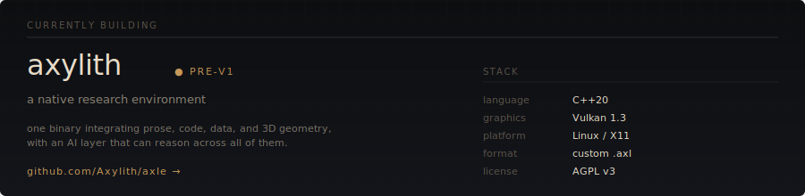
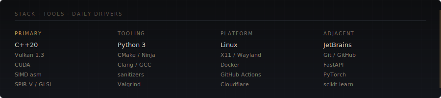

  

  <a href="https://devbhatt.dev"><b>devbhatt.dev</b></a>
  &nbsp;·&nbsp;
  <a href="https://axylith.com"><b>axylith.com</b></a>
  &nbsp;·&nbsp;
  <a href="mailto:dev@axylith.com"><b>email</b></a>

---

### About

Third-year CS and Data Science dual-major at Mount Royal University. Calgary, Canada.

Deep work in GPU programming, SIMD, CUDA, and systems architecture. Previously built [ShapeSynth](https://github.com/Phosphor-cell), a GPU-native quad retopology engine that won a $15K pitch competition.

Build the foundation before the demo. Measure before optimizing. The boring discipline of `static_assert` on struct sizes, sanitizer matrices, and atomic file writes matters more than novel algorithms most days. Direct communication, honest pushback, iteration over speculation.

---

  

---

  

---

### Open to

- Engineering conversations about systems work, GPU programming, or research tooling
- Coffee (in Calgary) or video calls (anywhere) with people building real things
- Contributors to Axylith once the architecture stabilizes

Not currently looking for full-time roles &mdash; building Axylith full-time.

  &middot;

